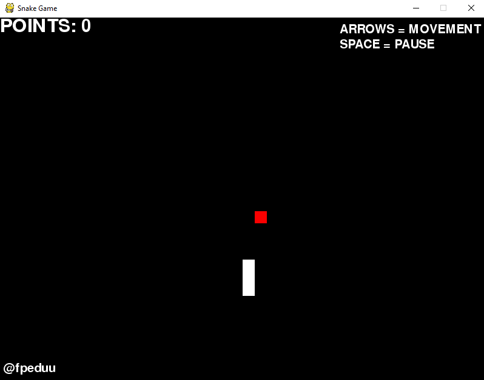

# Snake Game

## Snake Game Clone made with [Python 3](https://python.org/) and [Pygame](https://www.pygame.org/)

#### 🚧 Code refactoring to be done 🚧

### ✅ Features 

- [X] Base game
- [X] Punctuation
- [X] Bugs correction
- [] Restart possibility

### ❗ Prerequisites

Before running the game, You need to install [Python](https://python.org/) and [Pygame](https://www.pygame.org/wiki/GettingStarted).

### 🛠 Running the game

Once You got Python and Pygame on your computer, do the following steps:

```
# Clone this repository
$ git clone https://github.com/fpeduu/snake-game-python

# Access the local repository by your Terminal
$ cd snake-game-python

# Run the game
$ python snake_game.py
```

### 📷 Screenshot

